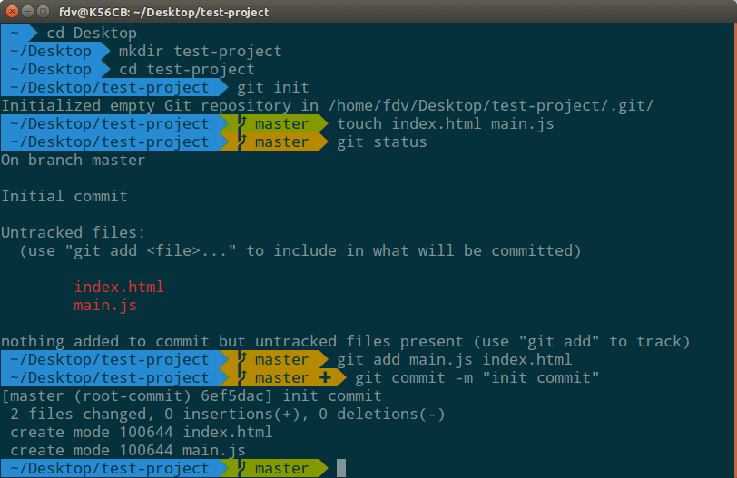

Zsh - командная оболочка unix, вместе с zsh часто устанавливают фреймворк oh-my-zsh. Он предлагает следующие крутые возможности:

* множество тем и плагинов
* мощный автокомплит с помощью клавиши <span class="key">Tab</span>, при одном нажатии zsh предложит все возможные варианты, при следующем нажатии <span class="key">Tab</span> мы сможем сами выбрать нужный аргумент
* валидация и исправление команд
* zsh запоминает историю директорий

## Установка 

Сначала необходимо установить zsh, затем oh-my-zsh. Для установки oh-my-zsh на компьютере уже должен быть установлен git, curl или wget

```bash
# Ubuntu, Debian
$ sudo apt install zsh

# macOS
$ brew install zsh zsh-completions

# проверить версию
$ zsh --version

# установить zsh по умолчанию
$ chsh -s $(which zsh)

# установка oh-my-zsh с помощью curl
$ sh -c "$(curl -fsSL https://raw.githubusercontent.com/robbyrussell/oh-my-zsh/master/tools/install.sh)"

# установка oh-my-zsh с помощью wget
$ sh -c "$(wget https://raw.githubusercontent.com/robbyrussell/oh-my-zsh/master/tools/install.sh -O -)"
```

## Темы

После установки oh-my-zsh становиться доступным файл конфигурации <span class="instr"> ~/.zshrc</span>, так же появилась директория в которой находятся темы, плагины, и файлы необходимые для работы фреймворка <span class="instr">~/.oh-my-zsh</span>. Для изменения темы необходимо открыть файл конфигурации, найти переменную <span class="instr">ZSH_THEME</span>, по умолчанию установлена тема robbyrussell (крутая минималистичная тема), мы можем установить другую тему просто изменив значение переменной, на имя необходимой темы, вот [список официальных тем](https://github.com/robbyrussell/oh-my-zsh/wiki/Themes), дополнительные [темы](https://github.com/robbyrussell/oh-my-zsh/wiki/External-themes) от других разработчиков. Установим тему agnoster, для ее полной поддержки нам необходимо иметь установленные [шрифты с powerline](https://github.com/powerline/fonts) (включают дополнительные символы).


<figure>

<figcaption>тема agnoster</figcaption>
</figure>

## Плагины

Вместе с установкой oh-my-zsh установились стандартные плагины они расположены в папке <span class="instr">~/.oh-my-zsh/plugins</span>, [вот весь список](https://github.com/robbyrussell/oh-my-zsh/wiki/Plugins) стандартных плагинов. Что бы подключить необходимый плагин, в файле конфигурации <span class="instr">~/.zshrc</span> в массиве <span class="instr">plugins</span> через пробел нужно добавить имя необходимых плагинов.

Так же можно установить плагины от сторонних разработчиков для этого существует директория <span class="instr">~/.oh-my-zsh/custom/plugins</span>. Вот несколько крутых плагинов:

[zsh-syntax-highlighting](https://github.com/zsh-users/zsh-syntax-highlighting) - добавляет подсветку синтаксиса\
[zsh-autosuggestions](https://github.com/zsh-users/zsh-autosuggestions) - очень крутой плагин на основе истории команд, предлагает возможные команды\
[autojump](https://github.com/ohmyzsh/ohmyzsh/tree/master/plugins/autojump) - плагин позволяющий удобно переходить по папкам\
[ansiweather](https://github.com/fcambus/ansiweather) - отображает погоду прямо в терминале

## Дополнительные возможности

```bash
# просмотр последних 20 директорий
$ dirs -v
$ d

# перейти в директорию под номером 2 
$ cd +2

# вывести список всех сокращений (алиасов)
$ alias

# в zsh можно переходить по папкам без использования команды cd
/ or cd /
~ or cd ~
... or cd ../..
.... or cd ../../..
```

## Настройка

В файле <span class="instr">~/.zshrc</span> помимо установки тем и плагинов можно настроить следующие переменные:

```bash
# при каждом запуске zsh ставится случайная тема
ZSH_THEME_RANDOM_CANDIDATES=( "robbyrussell" "agnoster" )

# чувствительность к регистру
CASE_SENSITIVE="true"

# автозамена между "_" и "-"
HYPHEN_INSENSITIVE="true"

# автоматическое обновление oh-my-zsh
DISABLE_AUTO_UPDATE="true"

# проверка обновлений каждые n дней
export UPDATE_ZSH_DAYS=13

# отключение цветов команды ls
DISABLE_LS_COLORS="true"

# отключение заголовка в терминале
DISABLE_AUTO_TITLE="true"

# включение коррекцию команд
ENABLE_CORRECTION="true"

# отображение красных точек при нажатии Tab для перебора аргументов
COMPLETION_WAITING_DOTS="true"

# отключает пометку не отслеживающихся файлов в Git репозитория
# как dirty, что ускоряет работу git
DISABLE_UNTRACKED_FILES_DIRTY="true" 

# изменение формата даты для команды history 
HIST_STAMPS="mm/dd/yyyy"

# возможность добавить путь к собственным темам и плагинам
ZSH_CUSTOM=/path/to/new-custom-folder
```

## Видео

Вы так же можете посмотреть моё видео по zsh и oh my zsh на youtube [ссылка](https://www.youtube.com/watch?v=ZNHkS4EnXhQ)