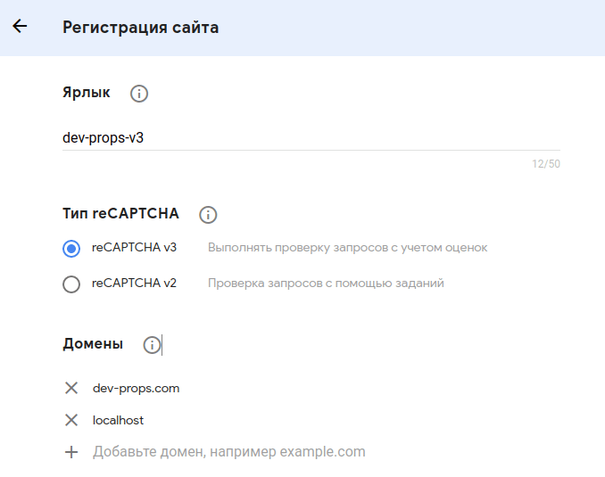
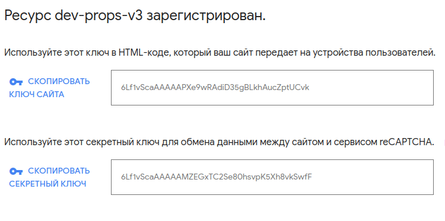

Как работает капча? С начало добавляем сайт в [панели администратора](https://www.google.com/recaptcha/admin/) капчи, получаем пару ключей один открытый другой закрытый, открытый используется на сайте он виден всем, закрытый же используется для проверки на сервере. На сайте мы подключаем скрипт капчи, и во время отправки формы с помощью капчи генерируем токен для текущего пользователя, после отправляем этот токен на сервер, где с помощью закрытого ключа этот токен делает запрос на сервер google где происходит проверка и нам приходит ответ является ли этот пользователь ботом. В зависимости от ответа разрешаем пользователю делать действия на сайте(логиниться, регистрироваться и прочие). Сразу же возникает можно ли выполнять проверку токена не на сервере, а в браузере? Ответ: Можно, только смысла в этом нет, это не безопасно и обойти эту проверку просто (проверка всегда должна выполнятся на сервере).

Подключать капчу будем к форме подписки на рассылку. Форма принимает е-мейл, делает запрос на сервер. На сервере е-мейл записывается в базу (теоретически), на клиент приходит ответ, об успешной записи. Рассмотрим наш пример.

**HTML:**

```html
<form class="subscription" name="subscribe-form-0">
  <label for="0">Email:</label>
  <input id="0" class="mail" name="email" type="text" />
  <input class="send-mail" type="submit" value="send" />
</form>
```

На форму навешен слушатель <span class="instr">submit</span>, который делает запрос на <span class="instr">'/.netlify/functions/fake-subscribe'</span> этот экшен находится на сервере, после успешного ответа выводится alert.

**JavaScript:**

```js
const subscribe_form_0 = document.forms["subscribe-form-0"];

subscribe_form_0.addEventListener("submit", async (e) => {
  e.preventDefault();
  const email = new FormData(e.target).get("email");
  if (email) {
    const response = await fetch("/.netlify/functions/fake-subscribe", {
      body: email,
      method: "POST"
    });
    const data = await response.json();
    alert(data);
  }
});
```

В качестве сервера используются функции Netlify позволяющие создавать экшены. Этот экшен на самом деле в базу ничего не записывает, а просто возвращает строку с обернутым е-мейлом:

```js
exports.handler = async (event, context) => {
  const email = event.body || null;
  if (email) {
    return {
      statusCode: 200,
      body: JSON.stringify(`user ${email} successfully subscribed`)
    };
  }
};
```

Итоговый результат:

<form class="subscription" name="subscribe-form-0">
  <label for="0">Email:</label>
  <input id="0" class="mail" name="email" type="text">
  <input class="send-mail" type="submit" value="send">
</form>

При вводе е-мейла и нажатии на кнопку <span class="instr">Send</span> получаем всплывающие окно об успешной подписке. Однако сейчас форма не защищена от спама и ботов. Начнем с reCaptcha V3

## Подключение невидимой reCaptcha v3

Регистрируем сайт в панели администратора. В домены добавляем домен сайта и если вы разрабатываете локально, хост на котором развернут сайт у меня это <span class="instr">localhost</span>

<figure>
  
  <figcaption>Регистрации капчи v3</figcaption>
</figure>

После успешной регистрации станут доступны пара ключей капчи:

<figure>
  
  <figcaption>Пара ключей</figcaption>
</figure>

В отличие от второй версии reCaptcha v3 не нужно проходить ни какие тесты, и выбирать светофоры, капча работает в фоне, и на основе вашего поведения на странице возвращает <span class="instr">score</span> от 1 до 0 где, 0 это скорее всего бот, а 1 это человек.

Добавим на страницу следующий скрип с параметром render и значением открытого ключа.

```js
<script src="https://www.google.com/recaptcha/api.js?render=XXX_OPEN_KEY"></script>
```

Можно заметить что в правом нижнем углу появился бейдж reCaptcha.

Создадим новую форму <span class="instr">subscribe_form_1</span> и добавим обработчик на нее. Вызываем метод <span class="instr">ready</span> и передаем в него колбек, что бы быть уверенным что капча доступна. В колбеке вызываем метод <span class="instr">execute</span> что бы получить токен. Далее делаем запрос на измененный экшен <span class="instr">/.netlify/functions/subscribe-captcha-v3</span> и теперь помимо emeil, передаем токен.

```js
subscribe_form_1.addEventListener("submit", (e) => {
  e.preventDefault();
  const email = new FormData(e.target).get("email");
  if (email) {
    grecaptcha.ready(async () => {
      const token = await grecaptcha.execute("XXX_OPEN_KEY", { action: "submit" });
      const response = await fetch("/.netlify/functions/subscribe-captcha-v3", {
        body: JSON.stringify({ email, token }),
        method: "POST"
      });
      const data = await response.json();
      alert(data);
    });
  }
});
```

Осталось сделать проверку на сервере. Проверяем пришел ли нам токен и е-мейл. Затем вызываем функцию <span>isValidCaptcaV3</span> и передаем в нее токен. Функция делает запрос на API капчи, в который get-параметрами передаем секретный ключ и токет. В ответ нам приходит следующий объект: <span class="instr">{
success: true,
challenge_ts: '2021-01-10T18:52:15Z',
hostname: 'localhost',
score: 0.9,
action: 'submit'
}</span> Нам понадобиться два поля, <span class="instr">success</span> - являлся ли отправленный токен валидным и <span class="instr">score</span> - счет запроса. Мы будем считать что пользователь прошел капчу если его счет больше или равен 0.6. Если пользователь прошел капчу мы возвращаем успешное сообщение.

**Серверный экшен:**

```js
const secretKey = "XXX_SECRET_KEY";
const api = "https://www.google.com/recaptcha/api/siteverify";

exports.handler = async (event, context) => {
  const { email, token } = JSON.parse(event.body);
  if (email && token) {
    const valid = await isValidCaptcaV3(token);
    if (valid) {
      return {
        statusCode: 200,
        body: JSON.stringify(`user ${email} successfully subscribed`)
      };
    }
  }
};

async function isValidCaptcaV3(token) {
  const url = `${api}?secret=${secretKey}&response=${token}`;
  return fetch(url, { method: "POST" })
    .then((response) => response.json())
    .then((data) => data && data.success && data.score >= 0.6)
    .catch((e) => {
      console.log(e);
      return false;
    });
}
```

Поздравляю reCaptcha v3 подключена на сайт:

<form class="subscription" name="subscribe-form-1">
<label for="1">Email:</label>
    <input id="1" class="mail" name="email" type="text">
    <input class="send-mail" type="submit" value="send">
</form>

## Подключение reCaptcha v2 чекбокс

В панели администратора в типе reCaptcha выбираем флажок "я не робот" так же указываем домен и получаем пару ключей. Капчу v2 можно рендерить автоматически, мы же будем делать это явно. Для этого форму добавим тег div c id <span class="instr">recaptcha-checkbox</span> в этом месте мы будем рендерить капчу с чекбоксом.

```html
<form class="subscription" name="subscribe-form-2">
  <label for="2">Email:</label>
  <input id="2" class="mail" name="email" type="text" />
  <input class="send-mail" type="submit" value="send" />
  <div id="recaptcha-checkbox"></div>
</form>
```

Далее нужно отрендерить капчу. Вызываем метод <span class="instr">render</span> в который передаем куда отредерить капчу и открытый ключ. <span class="instr">render</span> вернет id капчи это нам нужно по скольку мы используем несколько капч на странице и необходимо понимать к какой обращаться. Затем изменим слушатель формы, в метод <span class="instr">getResponse</span> передаем id капчи, в ответ получаем токен, но только в том случае если пользователь нажал на чекбокс. Иначе <span class="instr">getResponse</span> ничего не вернет. И если пользователь прошел капчу и ввел email делаем запрос на сервер. На сервер помимо токена и е-мейла передаем какой вид второй капчи мы используем по скольку (я для проверки не видимой и чекбокса я использую один метод). После успешного ответа сервера нужно сбросить капчу иначе можно будет отравить запрос со старым токеном, мы это делаем методом <span class="instr">reset</span> и указываем id капчи.

```js
const checkboxCaptcha = document.getElementById("recaptcha-checkbox");
let checkbox_widget_id = null;

grecaptcha.ready(() => {
  checkbox_widget_id = grecaptcha.render(checkboxCaptcha, {
    sitekey: "XXX_OPEN_KEY"
  });
});

subscribe_form_2.addEventListener("submit", async (e) => {
  e.preventDefault();
  const email = new FormData(e.target).get("email");
  const token = grecaptcha.getResponse(checkbox_widget_id);
  if (email && token) {
    const response = await fetch("/.netlify/functions/subscribe-captcha-v2", {
      body: JSON.stringify({ email, token, isCheckbox: true }),
      method: "POST"
    });
    const data = await response.json();
    if (data) {
      grecaptcha.reset(checkbox_widget_id);
      alert(data);
    }
  }
});
```

На сервере у нас появилась функция <span class="instr">isValidCaptcaV2</span> которая проверяем токен, функция может проверять капчу v2 двух типов. И капча считается успешной если с api google приходить ответ <span class="instr">success: true</span>

Экшен <span class="instr">/.netlify/functions/subscribe-captcha-v2</span>:

```js
const secretKeyCheckbox = "XXX_SECRET_KEY";
const secretKeyInvisible = "XXX_SECRET_KEY";
const api = "https://www.google.com/recaptcha/api/siteverify";

exports.handler = async (event, context) => {
  const { email, token, isCheckbox } = JSON.parse(event.body);
  if (email && token) {
    const valid = await isValidCaptcaV2(token, isCheckbox);
    if (valid) {
      return {
        statusCode: 200,
        body: JSON.stringify(`user ${email} successfully subscribed`)
      };
    }
  }
};

async function isValidCaptcaV2(token, isCheckbox) {
  const secret = isCheckbox ? secretKeyCheckbox : secretKeyInvisible;
  const url = `${api}?secret=${secret}&response=${token}`;
  return fetch(url, { method: "POST" })
    .then((response) => response.json())
    .then((data) => data && data.success)
    .catch((e) => {
      console.log(e);
      return false;
    });
}
```

Результат:

<form class="subscription" name="subscribe-form-2">
    <label for="2">Email:</label>
    <input id="2" class="mail" name="email" type="text">
    <input class="send-mail" type="submit" value="send">
    <div id="recaptcha-checkbox"></div>
</form>

## Подключение reCaptcha v2 невидимая

В панели администратора в типе reCaptcha выбираем "Невидимый значок reCAPTCHA", получаем пару ключей. Добавляем в форму блок с id <span class="instr">recaptcha-invisible</span> в нем будет рендерится капча. Механизм работы невидимой капчи немного отличается, необходимо явно вызывать выполнения капчи.

```html
<form class="subscription" name="subscribe-form-3">
  <label for="3">Email:</label>
  <input id="3" class="mail" name="email" type="text" />
  <input class="send-mail" type="submit" value="send" />
  <div id="recaptcha-invisible"></div>
</form>
```

Далее рендерем капчу с несколькими параметрами:

<span class="instr">sitekey</span> - отрытый ключ,

<span class="instr">badge</span> - inline, позволяет позиционировать бейдж с помощью css,

<span class="instr">invisible</span> - используется для создания невидимого виджета,
привязанного к div и выполняемого программно (наш случай),

<span class="instr">callback</span> - функция, которая вызываться при явном выполнение капчи.

Теперь обработчик явно вызывает выполение капчи с помощью метода <span class="instr">execute</span>. В результате вызывается колбек <span class="instr">mailSubscribe</span> в который передается токен, делается запрос на сервер и после успешного ответа, необходимо сбросить капчу. Серверный экшен остался без изменений.

```js
const invisibleCaptcha = document.getElementById("recaptcha-invisible");
let invisible_widget_id = null;

grecaptcha.ready(() => {
  invisible_widget_id = grecaptcha.render(invisibleCaptcha, {
    sitekey: "XXX_OPEN_KEY",
    badge: "inline",
    callback: mailSubscribe,
    size: "invisible"
  });
});

subscribe_form_3.addEventListener("submit", async (e) => {
  e.preventDefault();
  const email = new FormData(e.target).get("email");
  if (email) {
    grecaptcha.execute(invisible_widget_id);
  }
});

async function mailSubscribe(token) {
  if (token) {
    const email = new FormData(subscribe_form_3).get("email");
    const response = await fetch("/.netlify/functions/subscribe-captcha-v2", {
      body: JSON.stringify({ email, token, isCheckbox: false }),
      method: "POST"
    });
    const data = await response.json();
    if (data) {
      grecaptcha.reset(invisible_widget_id);
      alert(data);
    }
  }
}
```

Результат:

<form class="subscription" name="subscribe-form-3">
    <label for="3">Email:</label>
    <input id="3" class="mail" name="email" type="text">
    <input class="send-mail" type="submit" value="send">
    <div id="recaptcha-invisible"></div>
</form>

Так же стоит упомянуть что вы можете скрывать бейджы, но вы должны при этом
вставить следующий текст:

```html
This site is protected by reCAPTCHA and the Google
<a href="https://policies.google.com/privacy">Privacy Policy</a> and
<a href="https://policies.google.com/terms">Terms of Service</a> apply.
```

<script src="https://www.google.com/recaptcha/api.js?render=6LeB3xAaAAAAAPpM1dgtjAdLZ-z7i4Ekp4CGU0IL"></script>
<script src="/assets/js/captcha.js"></script>
